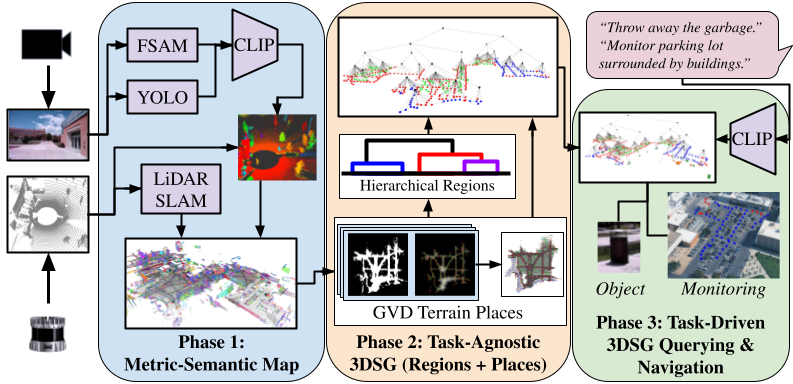

# Terra
This repository contains the code for *Terra: Hierarchical Terrain-Aware 3D Scene Graph for Task-Agnostic Outdoor Mapping*




# Table of Contents
- [Terra](#terra)
- [Table of Contents](#table-of-contents)
- [Paper](#paper)
- [Setup](#setup)
    - [Requirements](#requirements)
    - [Using Docker Container](#using-docker-container)
- [Datasets and Metric Mapping](#datasets-and-metric-mapping)
- [Building Terra](#building-terra)
- [Task-Execution with Terra](#task-execution-with-terra)

# Paper

**Preprint Citation:**

> C. R. Samuelson, A. Austin, S. Knoop, B. Romrell, G. R. Slade, T. W. McLain, and J. G. Mangelson, “Terra: Hierarchical Terrain-Aware 3D Scene Graph for Task-Agnostic Outdoor Mapping,” Sept 2025. [Online]. Available: https://arxiv.org/abs/2509.19579

**Accepted to ICRA 2026. Citation Pending.**


# Setup

### Requirements
* [Docker](https://docs.docker.com/engine/install/ubuntu/)
* NVIDIA GPU

Our repository is designed for ROS 2 Humble. To handle dependency issues, our repository is built in Docker using the following container.

### Using Docker Container

First pull our Terra docker container
```bash
docker pull frostlab/ros2_terra:latest
xhost +local:docker
```

Start the container in your terminal
```bash
docker run --rm -it --gpus all --net host -v /tmp/.X11-unix:/tmp/.X11-unix -v <path/to/terra_repo>:/docker_ros2_ws/src/terra -v <ros2_bags_folder>:/<ros2_bags_folder> -e DISPLAY=$DISPLAY frostlab/ros2_terra
```
Build and source the ros2 repository
```
tmux

cd docker_ros2_ws

colcon build --symlink-install --cmake-args -DCMAKE_BUILD_TYPE=Release

source install/setup.bash
```

# Datasets and Metric Mapping

The ros launch code uses LIO-SAM to build the metric map, extracts and saves relevant data in the dataset folder structure below.

<details open>

<summary><b>Dataset folder structure</b></summary>

```
my_dataset
├── global_pc
|   ├── global_pc_{timestamp}.npy
|   ├── ...
├── camera1_images
|   ├── cam1_img_{timestamp}.jpg
|   ├── ...
├── lidar_pc
|   ├── lidar_pc_{timestamp}.npy
|   ├── ...
├── transformations_lidar2cam1
|   ├── transform_lidar_to_cam1_{timestamp}.npy
|   ├── ...
├── transformations_lidar2global
|   ├── transform_lidar_to_map_{timestamp}.npy
|   └── ...
```

</details>

<details open>

<summary><b>Simulation: Business Campus Dataset</b></summary>

- Download the dataset: [Dense 1/8](https://gofile.me/7dj2d/g3y3vblhM) (3.30 GB), [Sparse 1/3](https://gofile.me/7dj2d/aJN8D565b) (1.66 GB), and [Sparse Full](https://gofile.me/7dj2d/HZqnxpZHR) (13.34 GB).
    - These links enable downloading the extracted metric data from each rosbag collected in HoloOcean.
        - For more information about the Business Campus World in HoloOcean see [here](https://byu-holoocean.github.io/holoocean-docs/v2.3.0/packages/BusinessCampus/BusinessCampus.html).
        - For more information on installing this world in HoloOcean see [here](https://byu-holoocean.github.io/holoocean-docs/v2.3.0/packages/docs/installation.html).
        - For more information on runing ros2 in HoloOcean see [here](https://byu-holoocean.github.io/holoocean-docs/v2.3.0/usage/ROS2.html).
    - Make sure the location of this downloaded metric data has been volumed into the docker container.
- Download the simulated YOLO model [here](https://gofile.me/7dj2d/0wFLzTul8).
    - After unzipping, the model is located in: `holo_3cls_nano_stepsz25_256imgsz_500epochs/weights/best.pt`.
    - Identify your container name in a terminal with: `docker ps`
    - Copy the model into the container with:
      ```
      docker cp <yolo_folder_location>/holo_3cls_nano_stepsz25_256imgsz_500epochs/weights/best.pt <container_name>:/holoocean_3cls.pt
      ```
- Given this metric data, proceed to [Building Terra](#building-terra).  

</details>


<details open>

<summary><b>Real-World: South Campus Dataset</b></summary>

- Download the dataset (*in progress*) 
- Put the rosbag in the volumed `ros2_bags_folder` so you can access it in the docker container 
- Copy the contents of the `config/south_campus/liosam_params.yaml` file to replace the contents in the `params.yaml` file in the `LIO-SAM/config` folder
- Update the `config/south_campus/params.yaml` to match the correct `rosbag_path` and `save_folder`.
- Now to build the metric point cloud map with LIO-SAM and save the data into our folder structure, run
```bash
ros2 launch terra_ros build_metric_map_south_campus.launch.py
```
</details>


<details open>

<summary><b>Custom Datasets</b></summary>

If you have a ROS 2 bag of your Ouster OS1-128 LiDAR and RGB Camera data, then do the following to run LIO-SAM:

- Edit the `params.yaml` file in the `LIO-SAM/config` folder to match your LiDAR and IMU ros topics as well as the extrinsic transformation between the two.
- Copy the contents `config/rviz2.rviz` file to replace the `rviz2.rviz` file in the `LIO-SAM/config` folder.
- Update the `params.yaml` ros parameters in `terra_ros/config` for your dataset and rosbag
- Now to build the metric point cloud map with LIO-SAM and save the data into our folder structure, run
```bash
ros2 launch terra_ros build_metric_map_multicam_rate.launch.py
```
</details>


# Building Terra

Change into the Terra repo in container with: `cd /docker_ros2_ws/src/terra`

<details open>

<summary><b>Building Metric-Semantic Map (MS Map)</b></summary>

Provided that you have all the data saved in the file structure shown above, you can build the metric-semantic map (ms map) as follows:
- Update the `terra/config/<dataset_name>/msmap.yaml` arguments to match the saved data folder path and YOLO terrain model location.
    - We provide different msmap yaml files showing capabilities of handling more than 1 camera image data as well as using YOLOE for datasets where you don't have a trained YOLO terrain model. 
- Run the MS Map code with the correct yaml filepath as an argument as follows: 
```bash
python3 -m terra.ms_map --params=terra/config/<dataset_name>/msmap.yaml
```
> [!NOTE]
> This will take a while to process at about 2-4 seconds per lidar-image pair.

To visualize the resulting MS Map, we have provided a helper script where you just need to pass in the filepath to your saved data folder. Each different semantic CLIP id will have a different color. For example:
```bash
python3 -m terra.visualize_msmap --data_folder=/data/folder --output_folder=/directory/to/ms_map/output --num_terrain=3 --pt_size=2.0
```

</details>


<details open>

<summary><b>Building Region and Place Layers from MS Map</b></summary>

With the results saved from MS Map, you can build the terrain-aware places and region layers of the 3DSG as follows:
- Update the `terra/config/<dataset_name>/build_terra.yaml` arguments to match the saved MS Map files location and other relevant arguments.
- Run Build Terra code with your updated yaml file as an argument as follows: 
```bash
python3 -m terra.build_terra --params=/path/to/build_terra.yaml
```

To visualize the resulting 3D Scene Graph, run: 
```bash
python3 -m terra.visualize_terra --terra_3dsg=/path/to/saved/terra_nxgraph.pkl --global_pc=/folder/path/to/global_pc/ --num_terrains=num_terrains --view_json=view.json
```
- The arguments are defined as:
    - `terra_3dsg`: Path to the saved 3DSG. 
        - *Note: `build_terra.py` saves a terra_nxgraph.pkl and a Terra.pkl file. The first is just the nx.Graph 3DSG object and the latter is our Terra 3DSG class. This is asking for the first one.* 
    - `global_pc`: Path to the folder that contains all of the global point clouds saved from the metric mapping step.
    - `num_terrains`: Integer of the number of terrains used by the YOLO model
    - `view_json`: (Optional) Saved json file to tell Open3D to display the 3DSG at a certain angle and distance.

</details>

# Task-Execution with Terra


<details open>

<summary><b>Object Retrieval Tasks</b></summary>

To perform object retrieval tasks with the Terra 3DSG saved from [Building Terra](#building-terra), is done as follows:
- Modify the `object_retrieval.yaml` file for as many object retrieval tasks of interest as well as other parameters described below.
- Run the object retrieval task as follows:
```bash
python3 -m terra.object_retrieval_task --params=/path/to/object_retrieval.yaml
```
- YAML parameters are defined as:
    - `terra`: Path to the saved Terra 3DSG. 
        - *Note: `build_terra.py` saves a terra_3dsg.pkl and a Terra.pkl file. The first is just the nx.Graph 3DSG object and the latter is our Terra 3DSG class. This is asking for the latter.*
    - `object_tasks`: YAML list of object tasks
    - `prediction_method`: Pass a string of the method to use from the following [ms_avg, ms_max, 3dsg]. These methods are explained in detail in the paper. (Default: `ms_avg`)
    - `alpha`: Threshold to determine whether an object is task relevant (i.e. if its cosine-similarity score is above `alpha` then it is task-relevant). (Default: `0.23`) 

</details>


<details open>

<summary><b>Region Monitoring Tasks</b></summary>

To perform region monitoring tasks with the Terra 3DSG saved from [Building Terra](#building-terra), is done as follows:
- Modify the `region_querying.yaml` file for as many region monitoring tasks of interest as well as other parameters described below.
- Run the region monitoring task as follows:
```bash
python3 -m terra.region_querying_task --params=/path/to/region_querying.yaml
```
- YAML parameters are defined as:
    - `terra`: Path to the saved Terra 3DSG. 
        - *Note: `build_terra.py` saves a terra_3dsg.pkl and a Terra.pkl file. The first is just the nx.Graph 3DSG object and the latter is our Terra 3DSG class. This is asking for the latter.*
    - `region_tasks`: YAML list of region monitoring tasks
    - `prediction_method`: Pass a string of the method to use from the following [max, thresh, mix, aib]. These methods are explained in detail in the paper. (Default: `max`)
    - `alpha`: Threshold to determine whether a region is task relevant (i.e. if its cosine-similarity score is above `alpha` then it is task-relevant). Only used for methods [thresh, mix, aib]. (Default: `0.23`) 
    - `k`: Parameter for selecting the top-K task relevant regions. Only used for methods [max, mix]. (Default: `1`)

</details>


<details open>

<summary><b>Terrain-Aware Path Planning to Destination Query</b></summary>

To perform path planning to a destination query, do the following:
- Modify the `path_panning.yaml` file based on your destination query and the terrain preferences
- Run the path planning task as follows:
```bash
python3 -m terra.path_planning_task --params=/path/to/path_planning.yaml
```
- YAML parameters are defined as;
    - `terra`: Path to the saved Terra 3DSG. 
        - *Note: `build_terra.py` saves a terra_3dsg.pkl and a Terra.pkl file. The first is just the nx.Graph 3DSG object and the latter is our Terra 3DSG class. This is asking for the latter.*
    - `terrain_preferences`: List the terrain indices that are `preferred` and `forbidden` based on the terrain input and ordering used in `build_terra.yaml`. The `penalties` are defined by each terrain index and an associated weight. 
    - `queries`: 
        - `destination`: String explaining the destination query
        - `start`: (Optional) string explaining start location. If not used, default's to start being the first place node in the graph
    - `prediction_method`: Pass a string of the method to use from the following [ms_avg, ms_max, 3dsg]. These methods are explained in detail in the paper. (Default: `ms_avg`)
    - `alpha`: Threshold to determine whether an object is task relevant (i.e. if its cosine-similarity score is above `alpha` then it is task-relevant). (Default: `0.23`) 

</details>
